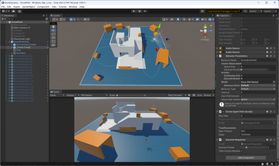
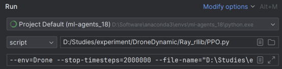
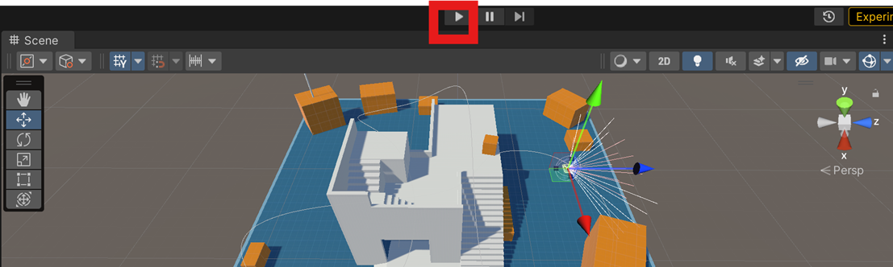
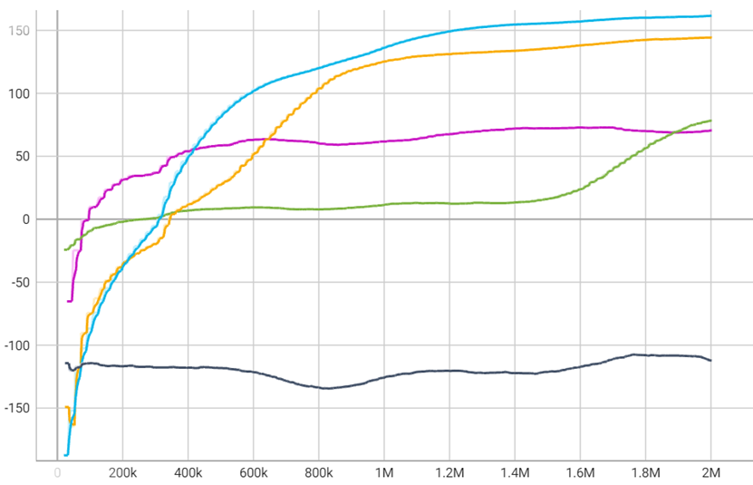

# DronePP-RL
A simulation for drone path planning based on ML-Agents and RLlib

## Environment configuration:
1. Unity editor 2021.3.14f1 or later
2. ML-agents toolkit 18 or later
3. Install ray framework
4. Pycharm community version

After opening the project, use the DronePath Scene and fine-tune the components as needed.

Ray provides code templates for reference. You can adapt the code according to your own needs, modify the hyperparameters before running the adapted code, and use the binary executable file exported by Unity as the environment.

After the adjustment is completed, click Run in Pycharm. If you want to train in the Unity editor, you must wait for the interface communication to start and then manually click the Run button in the Unity editor to start training.

After the training is completed, a log file is automatically generated, such as "PPO_unity3d_571a7_00000_0_2023-10-04_16-02-19". You can open it in tensorboard to see the training process curve.

